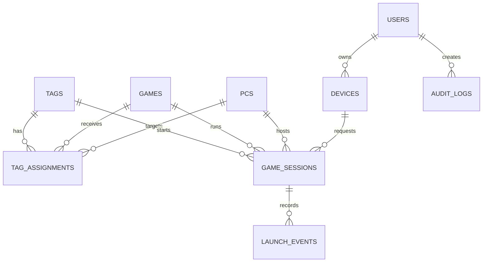

# TAGAME — Database Specification

## Conventions

- The database is relational.
- The initial database engine is SQLite.
- Every internal primary key uses a UUID. UUIDv7 is preferred for new records; UUIDv4 is acceptable when UUIDv7 is unavailable.
- All table and field names are in `snake_case` English.
- Timestamps use UTC and are named with the `_at` suffix.
- Tokens are stored as hashes, never as plaintext.
- UUID values are stored as `TEXT` in canonical 36-character form for SQLite portability and readability.
- `steam_appid` remains an integer because it is an external Steam identifier.
- Boolean fields use `true`/`false` and are named with an `is_` or descriptive adjective where useful.

## SQLite runtime requirements

- Use `journal_mode = WAL` so readers and writers can operate concurrently.
- Use `foreign_keys = ON` for every connection.
- Configure a write `busy_timeout` so short write contention is retried instead of failing immediately.
- Keep the database file and its WAL state on a local CasaOS volume, never on a network filesystem.
- Apply schema changes through versioned migrations.

## Entity relationship overview

## Tables

### `users`

Application accounts. A user is either an administrator or a guest.

| Field | Type | Rules |
|---|---|---|
| `id` | UUID | Primary key |
| `name` | string | Required |
| `email` | string | Required, unique |
| `password_hash` | string | Required for password-based login |
| `role` | enum/string | `admin` or `guest` |
| `is_active` | boolean | Disabled users cannot authenticate |
| `created_at` | timestamp | Required |
| `last_login_at` | timestamp | Nullable |

### `devices`

Authorized readers such as Android phones, iPhones, tablets, or web clients.

| Field | Type | Rules |
|---|---|---|
| `id` | UUID | Primary key |
| `user_id` | UUID | Foreign key to `users.id` |
| `name` | string | User-facing name, e.g. `Bryan S20 FE` |
| `platform` | string | `android`, `ios`, or `web` |
| `model` | string | Nullable |
| `token_hash` | string | Required, unique; never store the raw token |
| `is_active` | boolean | Revocation switch |
| `created_at` | timestamp | Required |
| `last_seen_at` | timestamp | Nullable |
| `revoked_at` | timestamp | Nullable |

### `pcs`

Computers on which the agent can execute game actions.

| Field | Type | Rules |
|---|---|---|
| `id` | UUID | Primary key |
| `name` | string | Required |
| `hostname` | string | Required |
| `agent_token_hash` | string | Required, unique; never store the raw token |
| `is_active` | boolean | Disabled PCs cannot receive events |
| `created_at` | timestamp | Required |
| `last_heartbeat_at` | timestamp | Nullable |

### `tags`

Logical NFC tags. The `token` is the UUID written into the tag's NDEF payload.

| Field | Type | Rules |
|---|---|---|
| `id` | UUID | Primary key |
| `token` | UUID | Required, unique, random opaque identifier |
| `name` | string | Required, e.g. `Card — Elden Ring` |
| `is_active` | boolean | Disabled tags cannot trigger actions |
| `created_at` | timestamp | Required |
| `last_used_at` | timestamp | Nullable |

### `games`

Configured games that may be launched.

| Field | Type | Rules |
|---|---|---|
| `id` | UUID | Primary key |
| `name` | string | Required |
| `steam_appid` | integer | Required, unique |
| `executable_name` | string | Nullable; useful for process detection/stop |
| `is_active` | boolean | Inactive games cannot be launched |
| `created_at` | timestamp | Required |

### `tag_assignments`

Associates a tag with a game and an execution PC. Keeping this in its own table allows reassignment history.

| Field | Type | Rules |
|---|---|---|
| `id` | UUID | Primary key |
| `tag_id` | UUID | Foreign key to `tags.id` |
| `game_id` | UUID | Foreign key to `games.id` |
| `pc_id` | UUID | Foreign key to `pcs.id` |
| `is_active` | boolean | Only one current active assignment per tag is allowed |
| `created_at` | timestamp | Required |
| `ended_at` | timestamp | Nullable; set when reassigned or disabled |

### `game_sessions`

Runtime state for a game started through TAGAME. This is the source for start/stop toggle behavior; `tags.is_active` is not runtime state.

| Field | Type | Rules |
|---|---|---|
| `id` | UUID | Primary key |
| `tag_id` | UUID | Foreign key to `tags.id` |
| `game_id` | UUID | Foreign key to `games.id` |
| `pc_id` | UUID | Foreign key to `pcs.id` |
| `device_id` | UUID | Foreign key to `devices.id` |
| `steam_appid` | integer | Snapshot from `games` at launch time |
| `status` | enum/string | `starting`, `running`, `stopping`, `stopped`, `error` |
| `started_at` | timestamp | Nullable until agent confirms start |
| `ended_at` | timestamp | Nullable |
| `last_heartbeat_at` | timestamp | Nullable |
| `error_message` | string | Nullable |

### `launch_events`

Immutable request and outcome history. One user action produces one event.

| Field | Type | Rules |
|---|---|---|
| `id` | UUID | Primary key |
| `session_id` | UUID | Nullable foreign key to `game_sessions.id` |
| `tag_id` | UUID | Foreign key to `tags.id` |
| `game_id` | UUID | Nullable foreign key to `games.id` |
| `pc_id` | UUID | Nullable foreign key to `pcs.id` |
| `device_id` | UUID | Foreign key to `devices.id` |
| `action` | enum/string | `start` or `stop` |
| `status` | enum/string | `received`, `validated`, `dispatched`, `agent_acknowledged`, `launch_requested`, `stop_requested`, `completed`, `rejected`, `error`, or `timeout` |
| `result` | enum/string | Nullable until terminal; `success`, `rejected`, `error`, or `timeout` |
| `error_message` | string | Nullable |
| `source_ip` | string | Nullable; local audit information |
| `created_at` | timestamp | Required |
| `validated_at` | timestamp | Nullable |
| `dispatched_at` | timestamp | Nullable |
| `agent_acknowledged_at` | timestamp | Nullable |
| `action_requested_at` | timestamp | Nullable; launch or stop request issued by agent |
| `completed_at` | timestamp | Nullable; terminal result recorded |

`launch_events.status` tracks delivery and execution progress. `game_sessions.status` tracks the actual game process state. The UI may combine both into one timeline, but they must remain separate sources of truth.

### `audit_logs`

Administrative and security-sensitive changes.

| Field | Type | Rules |
|---|---|---|
| `id` | UUID | Primary key |
| `user_id` | UUID | Foreign key to `users.id` |
| `action` | string | E.g. `device_revoked`, `tag_assigned`, `user_role_changed` |
| `entity_type` | string | E.g. `device`, `tag`, `game`, `user` |
| `entity_id` | UUID | ID of the affected entity |
| `details` | JSON | Structured before/after details without secrets |
| `created_at` | timestamp | Required |

## Important integrity constraints

1. `users.email`, `devices.token_hash`, `pcs.agent_token_hash`, `tags.token`, and `games.steam_appid` are unique.
2. A tag may have only one active `tag_assignments` row.
3. A disabled user, device, tag, game, PC, or assignment cannot start a new session.
4. `game_sessions` and `launch_events` preserve snapshots and history even when an association later changes.
5. Raw device and agent tokens are never written to the database or logs.
