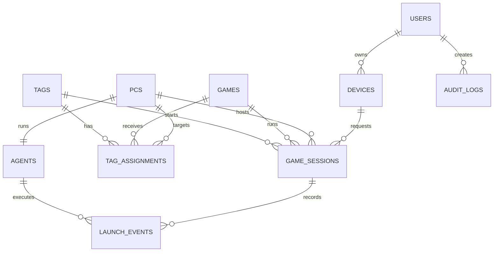

# TAGAME — Database Specification

## Conventions

- The database is relational.
- The initial database engine is SQLite.
- Every internal primary key and internal entity identifier uses a UUID. UUIDv7 is preferred for new records; UUIDv4 is acceptable when UUIDv7 is unavailable.
- Internal identifiers must never use sequential numeric values, auto-increment columns, or other predictable numbering schemes. UUIDs are used as opaque identifiers to reduce identifier enumeration and accidental exposure of record counts; authorization must still be enforced independently.
- All table and field names are in `snake_case` English.
- Timestamps use UTC and are named with the `_at` suffix.
- Tokens are stored as hashes, never as plaintext.
- UUID values are stored as `TEXT` in canonical 36-character form for SQLite portability and readability.
- `steam_appid` remains an integer because it is an external Steam identifier, not an internal database ID.
- Boolean fields use `true`/`false` and are named with an `is_` or descriptive adjective where useful.

## SQLite runtime requirements

- Use `journal_mode = WAL` so readers and writers can operate concurrently.
- Use `foreign_keys = ON` for every connection.
- Configure a write `busy_timeout` so short write contention is retried instead of failing immediately.
- Keep the database file and its WAL state on a local CasaOS volume, never on a network filesystem.
- Apply schema changes through versioned migrations.
- Prisma is the typed database access layer and the initial migration tool for the SQLite schema.

## Entity relationship overview

## Tables

### `users`

Application accounts. A user is either an administrator or a guest.

| Field | Type | Rules |
|---|---|---|
| `id` | UUID | Primary key |
| `name` | string | Required |
| `email` | string | Required, unique |
| `password_hash` | string | Required for password-based login |
| `role` | enum/string | `admin` or `guest` |
| `profile_photo_url` | string | Nullable; reserved for a future profile photo |
| `is_active` | boolean | Disabled users cannot authenticate |
| `created_at` | timestamp | Required |
| `updated_at` | timestamp | Required |
| `last_login_at` | timestamp | Nullable |
| `revoked_at` | timestamp | Nullable; set when account access is revoked |

The `role` field is the only current permission role model. `admin` and `guest` are not separate tables. JWT access tokens are not stored in this table; any future refresh-token or browser-session records must use a separate revocable credential table.

### `devices`

Authorized readers such as Android phones, iPhones, tablets, or web clients.

| Field | Type | Rules |
|---|---|---|
| `id` | UUID | Primary key |
| `user_id` | UUID | Foreign key to `users.id` |
| `name` | string | User-facing name, e.g. `Bryan S20 FE` |
| `platform` | string | `android`, `ios`, or `web` |
| `model` | string | Nullable |
| `token_hash` | string | Required, unique; never store the raw token |
| `is_active` | boolean | Revocation switch |
| `created_at` | timestamp | Required |
| `last_seen_at` | timestamp | Nullable |
| `revoked_at` | timestamp | Nullable |

### `pcs`

Physical computers on which an agent can execute game actions.

| Field | Type | Rules |
|---|---|---|
| `id` | UUID | Primary key |
| `name` | string | Required |
| `hostname` | string | Required |
| `is_active` | boolean | Disabled PCs cannot receive events |
| `created_at` | timestamp | Required |
| `updated_at` | timestamp | Required |

The PC does not store the agent credential directly. The credential belongs to the related `agents` record.

### `agents`

Registered installations of the TAGAME PC agent. The initial model allows one active agent installation per PC; reinstalling or re-pairing creates or replaces an agent record without changing the physical PC identity.

| Field | Type | Rules |
|---|---|---|
| `id` | UUID | Primary key |
| `pc_id` | UUID | Required, unique foreign key to `pcs.id` |
| `agent_token_hash` | string | Required, unique; never store the raw token |
| `version` | string | Nullable |
| `status` | enum/string | `online`, `degraded`, `offline`, or `revoked` |
| `created_at` | timestamp | Required |
| `paired_at` | timestamp | Nullable |
| `last_heartbeat_at` | timestamp | Nullable |
| `revoked_at` | timestamp | Nullable |
| `last_error` | string | Nullable; safe diagnostic only, never a secret |

The raw agent token exists only in the agent installation. The API authenticates the agent using its credential and validates that the requested event targets the associated PC.

### `tags`

Logical NFC tags. The `token` is the UUID written into the tag's NDEF payload.

| Field | Type | Rules |
|---|---|---|
| `id` | UUID | Primary key |
| `token` | UUID | Required, unique, random opaque identifier |
| `name` | string | Required, e.g. `Card — Elden Ring` |
| `is_active` | boolean | Disabled tags cannot trigger actions |
| `created_at` | timestamp | Required |
| `updated_at` | timestamp | Required |
| `last_used_at` | timestamp | Nullable |

### `games`

Configured games that may be launched.

| Field | Type | Rules |
|---|---|---|
| `id` | UUID | Primary key |
| `name` | string | Required |
| `steam_appid` | integer | Required, unique |
| `cover_url` | string | Nullable; cached or manually supplied cover image URL |
| `cover_source` | enum/string | Nullable; `manual`, `steam`, or `external` |
| `cover_updated_at` | timestamp | Nullable |
| `executable_name` | string | Nullable; useful for process detection/stop |
| `is_active` | boolean | Inactive games cannot be launched |
| `created_at` | timestamp | Required |
| `updated_at` | timestamp | Required |

`steam_appid` is the canonical lookup key for future game metadata enrichment. Cover metadata is presentation-only: a remote image service being unavailable must not prevent a game from launching. A cover URL may be replaced manually by an administrator.

### `tag_assignments`

Associates a tag with a game and an execution PC. Keeping this in its own table allows reassignment history.

| Field | Type | Rules |
|---|---|---|
| `id` | UUID | Primary key |
| `tag_id` | UUID | Foreign key to `tags.id` |
| `game_id` | UUID | Foreign key to `games.id` |
| `pc_id` | UUID | Foreign key to `pcs.id` |
| `is_active` | boolean | Only one current active assignment per tag is allowed |
| `created_at` | timestamp | Required |
| `ended_at` | timestamp | Nullable; set when reassigned or disabled |

### `game_sessions`

Runtime state for a game started through TAGAME. This is the source for start/stop toggle behavior; `tags.is_active` is not runtime state.

| Field | Type | Rules |
|---|---|---|
| `id` | UUID | Primary key |
| `tag_id` | UUID | Foreign key to `tags.id` |
| `game_id` | UUID | Foreign key to `games.id` |
| `pc_id` | UUID | Foreign key to `pcs.id` |
| `device_id` | UUID | Foreign key to `devices.id` |
| `steam_appid` | integer | Snapshot from `games` at launch time |
| `status` | enum/string | `starting`, `running`, `stopping`, `stopped`, `error` |
| `started_at` | timestamp | Nullable until agent confirms start |
| `ended_at` | timestamp | Nullable |
| `last_heartbeat_at` | timestamp | Nullable |
| `error_message` | string | Nullable |

### `launch_events`

Immutable request and outcome history. One user action produces one event.

| Field | Type | Rules |
|---|---|---|
| `id` | UUID | Primary key |
| `session_id` | UUID | Nullable foreign key to `game_sessions.id` |
| `tag_id` | UUID | Foreign key to `tags.id` |
| `game_id` | UUID | Nullable foreign key to `games.id` |
| `pc_id` | UUID | Nullable foreign key to `pcs.id` |
| `agent_id` | UUID | Nullable foreign key to `agents.id` |
| `device_id` | UUID | Foreign key to `devices.id` |
| `action` | enum/string | `start` or `stop` |
| `status` | enum/string | `received`, `validated`, `dispatched`, `agent_acknowledged`, `launch_requested`, `stop_requested`, `completed`, `rejected`, `error`, or `timeout` |
| `result` | enum/string | Nullable until terminal; `success`, `rejected`, `error`, or `timeout` |
| `error_message` | string | Nullable |
| `source_ip` | string | Nullable; local audit information |
| `created_at` | timestamp | Required |
| `validated_at` | timestamp | Nullable |
| `dispatched_at` | timestamp | Nullable |
| `agent_acknowledged_at` | timestamp | Nullable |
| `action_requested_at` | timestamp | Nullable; launch or stop request issued by agent |
| `completed_at` | timestamp | Nullable; terminal result recorded |

`launch_events.status` tracks delivery and execution progress. `game_sessions.status` tracks the actual game process state. The UI may combine both into one timeline, but they must remain separate sources of truth.

### `audit_logs`

Administrative and security-sensitive changes.

| Field | Type | Rules |
|---|---|---|
| `id` | UUID | Primary key |
| `user_id` | UUID | Foreign key to `users.id` |
| `action` | string | E.g. `device_revoked`, `tag_assigned`, `user_role_changed` |
| `entity_type` | string | E.g. `device`, `tag`, `game`, `user` |
| `entity_id` | UUID | ID of the affected entity |
| `details` | JSON | Structured before/after details without secrets |
| `created_at` | timestamp | Required |

## Optional supporting tables

These tables are reserved for flows that may be added after the first database foundation. They are not required for the initial core schema unless their corresponding feature is selected.

### `pairing_codes`

Short-lived, one-time codes used to pair a reader device or PC agent without displaying a long-lived credential.

| Field | Type | Rules |
|---|---|---|
| `id` | UUID | Primary key |
| `code_hash` | string | Required; never store the raw pairing code |
| `type` | enum/string | `reader` or `agent` |
| `user_id` | UUID | Nullable foreign key to `users.id`; used for reader pairing |
| `pc_id` | UUID | Nullable foreign key to `pcs.id`; used for agent pairing |
| `expires_at` | timestamp | Required |
| `used_at` | timestamp | Nullable; a code is single-use |
| `created_at` | timestamp | Required |

### `auth_sessions`

Optional revocable browser sessions if the implementation later adds refresh tokens to the short-lived JWT access-token flow.

| Field | Type | Rules |
|---|---|---|
| `id` | UUID | Primary key |
| `user_id` | UUID | Required foreign key to `users.id` |
| `refresh_token_hash` | string | Required, unique; never store the raw refresh token |
| `created_at` | timestamp | Required |
| `last_used_at` | timestamp | Nullable |
| `expires_at` | timestamp | Required |
| `revoked_at` | timestamp | Nullable |

## Important integrity constraints

1. `users.email`, `devices.token_hash`, `agents.agent_token_hash`, `tags.token`, and `games.steam_appid` are unique.
2. A tag may have only one active `tag_assignments` row.
3. A PC may have only one current active agent installation.
4. A disabled user, device, tag, game, PC, agent, or assignment cannot start a new session.
5. `game_sessions` and `launch_events` preserve snapshots and history even when an association later changes.
6. Raw device tokens, agent tokens, JWT access tokens, passwords, and refresh tokens are never written to the database or logs.
7. `cover_url` and other external metadata must never be required for launch authorization or Steam execution.
